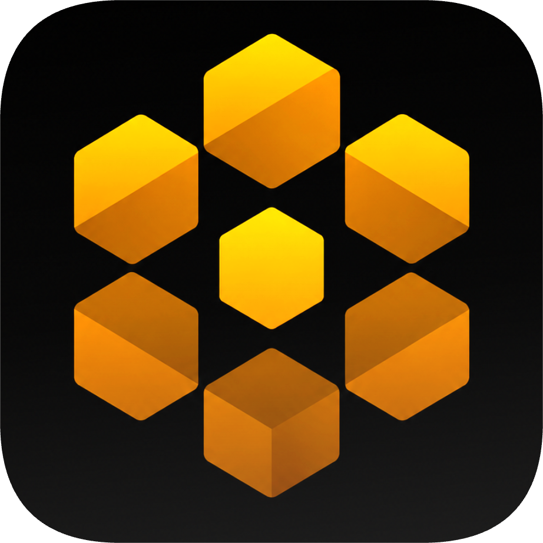

<div align="center">



# LaRuche

**Your personal AI hive. Local first, auditable, built in Rust.**

LaRuche is a desktop and server application for running an AI agent on your own
machine. It combines a resilient agent engine, cognitive memory, supervised automation,
native computer and browser control, voice, messaging channels and a local mesh.

**[infinition.github.io/LaRuche](https://infinition.github.io/LaRuche/)**

[](LICENSE)


[](https://github.com/infinition/LaRuche/actions/workflows/ci.yml)
[](https://github.com/infinition/LaRuche/releases)

[Quick start](#quick-start) · [Capabilities](#what-laruche-does) · [Architecture](#architecture) · [Wiki](wiki/Home.md) · [Changelog](CHANGELOG.md)

</div>

---

## What is LaRuche

LaRuche is a self-hosted AI agent written primarily in Rust. The desktop application
opens the web interface in its own window and starts the local node when needed. The
same node can run alone on a server, and the lightweight desktop client can discover
and use another hive on the local network.

The core works with llama.cpp, Ollama, LM Studio, vLLM, OpenAI-compatible endpoints,
Anthropic and Codex authentication. Local models are the default use case, but cloud
providers remain available when wanted.

The interface, memory, sessions, skills and configuration stay on your machine. The web
assets are bundled, the node binds to loopback by default, and the default memory is a
SQLite database that can be inspected and backed up with ordinary tools.

## What LaRuche does

### Agent engine

The butinage engine is a hardened ReAct loop built for the uneven tool-calling behavior
of local models. It supports native provider calls with tolerant fallbacks, JSON Schema
validation, token and tool-output budgets, per-tool timeouts, cooperative cancellation,
live steering, anti-loop detection, context compaction and parallel scout agents.

An eval harness runs fixed missions against the assembled engine, not a simplified
mock, so changes can be measured against saved baselines.

### Cognitive memory

Memory is a graph of nodes and facts over SQLite, FTS5 and optional embeddings. Recall
combines semantic and full-text results. Importance decays, updated facts supersede stale
ones, and only memories used in an answer receive hebbian reinforcement.

The map can be exported to markdown in its own git repository. `git log` becomes a
learning timeline, `git diff` shows what changed, and a previous snapshot can be
re-imported without replacing the whole database.

### Computer, browser and images

The native `computer` tool can inspect the Windows accessibility tree, capture any
monitor, move or resize windows, and operate the mouse, keyboard and clipboard. A
visible halo shows automated actions, an elevation check explains blocked input, and
`Ctrl+Alt+Shift+H` is the emergency stop.

The dedicated [Chrome extension](wiki/guides/Chrome-Extension.md) connects LaRuche to
the browser you already use, including its open tabs and signed-in sessions. The browser
tool handles frames, shadow DOM, overlays, uploads, downloads, dialogs, touch emulation
and responsive viewport checks. Consent banners are reported, never accepted
automatically.

Images can be pasted, dropped or attached in chat. Tool screenshots and webcam captures
reach vision-capable models, and oversized PNG or JPEG inputs are resized before they
hit provider limits.

### Supervision and automation

LaReine is the supervision layer. In Autonomous mode it can approve an answer or send
the worker through a fresh agent run. Hybrid mode escalates low-confidence judgments;
Human in the loop flags every reviewed answer without rewriting it automatically. A
third level watches stalled plans while they run, and selected memory or skill changes
can go through a durable approval queue. The [full LaReine guide](wiki/concepts/LaReine.md)
covers its modes, evidence, scorecards, safeguards and current Tier 2 boundaries.

Its reviews can also become an opt-in training dataset. LaRuche records the request,
rejected draft, chosen answer, critique and scores, then exports JSONL for
[SFT, DPO preference training or judge distillation](wiki/guides/Training-Datasets.md).
Secret values are masked before capture; full exchange text is otherwise preserved for
explicit curation.

Automation includes editable crons, long-running missions, a kanban board and compiled
watchers. Watchers evaluate deterministic rules for files, commands, services, HTTP
responses and correlated events. A model is called only when the rule explicitly asks
for one.

The [table ronde](wiki/concepts/Table-Ronde.md) runs a bounded multi-agent deliberation.
Answer, Code, Research and Experiment missions get different deliverables and strict
tool whitelists. Specialists first work alone, then review each other, face a dedicated
contrarian and finish with an arbiter. The interface keeps disagreements visible,
streams every intervention and stores a reopenable transcript without treating the
debate as learned memory.

### Tools, skills and integrations

The default node registers 89 built-in tools for files, code, shell, git,
web research, memory, scheduling, machine control, media, jobs and delegation. Dynamic
selection sends only the relevant tool schemas to the model.

Skills are plain markdown. LaRuche ships a curated set, loads user skills from its data
directory, and can propose new ones through the background curator. Plugins and MCP
servers extend the registry at runtime. LaRuche is both an MCP client and an MCP server.

### Interfaces and channels

The same responsive SPA is available in the desktop window and at
`http://localhost:8419`. The project also includes a terminal TUI, Telegram integration,
Discord and Slack webhooks, a Chrome extension, a VS Code extension and an installable
PWA.

Voice mode supports streamed speech, wake word and interruption. The optional Python
services provide Whisper STT and several TTS backends, including Kokoro, Voicebox,
Voxtral, Edge TTS and any server exposing the OpenAI speech format.

### Security and local mesh

The node listens on loopback unless LAN access is explicitly enabled. Mutating routes
require authentication, CORS is restricted, rendered chat is sanitized, and sensitive
tools pass through approval rules.

Secrets are referenced by name. Values are substituted only at execution time and
masked if a tool echoes them back. The optional Miel mesh discovers hives over mDNS and
can exchange capabilities, messages, skills and memory facts with provenance.

## Quick start

### Install the desktop application

Download the latest release from the [releases page](https://github.com/infinition/LaRuche/releases/latest).
Windows and Linux releases include full desktop installers with the node bundled. A
lightweight client installer is also available for machines that should connect to an
existing hive instead of hosting one.

Portable archives contain three executables:

| Executable | Role |
|---|---|
| `laruche` | Desktop application, the normal entry point |
| `laruche-node` | Server, web interface and background services |
| `laruche-cli` | Terminal interface |

On macOS, use the portable archive. There is no signed DMG at this time.

### Build from source

Prerequisites:

- [Rust](https://rustup.rs/) stable
- A local model server such as llama.cpp, Ollama or LM Studio, or a supported API
  provider
- Optional: `ollama pull nomic-embed-text` for semantic memory recall

```bash
git clone https://github.com/infinition/LaRuche
cd LaRuche/laruche
cargo build --release -p laruche-node -p laruche-bureau
cargo run --release -p laruche-bureau
```

On Windows, `lancer_bureau.bat` performs the build and opens the desktop application.
`lancer_bureau_client.bat` starts the network client, and `decouvrir_ruches.bat` reports
which hives are visible over mDNS.

For a server-only installation:

```bash
cd LaRuche/laruche
cargo run --release -p laruche-node
```

Then open `http://localhost:8419`. Docker users can run `docker compose up` inside
`laruche/`.

First boot checks the model, embeddings and optional voice services. Providers,
per-channel models, context sizes, LaReine, the curator, secrets, MCP servers, channels
and tool permissions can then be changed live in Settings.

## Configuration

The main launch variables are:

| Variable | Default | Purpose |
|---|---|---|
| `LARUCHE_PORT` | `8419` | Web UI and API port |
| `LARUCHE_DATA_DIR` | OS user data directory | Hive home for memory, sessions, skills and configuration |
| `LARUCHE_MEMOIRE_BACKEND` | `sqlite` | Memory backend: `sqlite`, `native`, or `sidecar` |
| `LARUCHE_BIND_LAN` | off | Accept connections from other machines |
| `LARUCHE_URL` | local node | Desktop application target URL |
| `LARUCHE_EMBED_URL` | local Ollama | Embedding endpoint |
| `LARUCHE_EMBED_MODEL` | `nomic-embed-text` | Embedding model |
| `LARUCHE_TAVILY_KEY` | none | Tavily search key |
| `LARUCHE_BRAVE_KEY` | none | Brave Search key |
| `LARUCHE_SEARXNG_URL` | none | SearXNG instance |
| `LARUCHE_OKF_GIT_SECS` | `1800` | Memory snapshot interval, `0` disables it |
| `LARUCHE_HTTPS` | off | Serve HTTPS, required for microphones on remote devices |

The full reference is in the [wiki](wiki/reference/Configuration.md).

## Data on disk

Installed builds use one shared hive home:

| Platform | Default location |
|---|---|
| Windows | `%APPDATA%\LaRuche` |
| macOS | `~/Library/Application Support/LaRuche` |
| Linux | `~/.local/share/laruche` or `$XDG_DATA_HOME/laruche` |

`LARUCHE_DATA_DIR` overrides this location. When the node is launched from an existing
hive directory, including a source checkout with existing state, it keeps using that
directory for compatibility.

The hive home contains `memoire.db`, sessions, skills, plugins, secrets, configuration,
journals and the optional `memoire-okf/` git history.

## Architecture

The Cargo workspace currently contains 17 Rust packages. The main pieces are:

| Package | Role |
|---|---|
| `laruche-bureau` | Tauri desktop application and LAN client discovery |
| `laruche-node` | axum server, web UI, channels, MCP server and background jobs |
| `laruche-client` | Shared client library |
| `laruche-cli` | Terminal TUI |
| `laruche-dashboard` | Embedded vanilla JavaScript SPA |
| `laruche-essaim` | Providers, tools, prompts, sessions, curator and LaReine |
| `laruche-butinage` | ReAct loop, planning, budgets, anti-loop logic and compaction handoff |
| `laruche-memoire` | SQLite memory, FTS5, embeddings, ranking and OKF import/export |
| `laruche-watchers` | Watcher store and compiled rule DSL |
| `miel-protocol` | mDNS discovery, node manifests and mesh messages |
| `laruche-skills` | Skill parsing, validation and storage |
| `laruche-kanban` | Task board used by missions and automation |
| `laruche-events` | Shared event types |
| `laruche-permissions` | Tool approval policy |
| `laruche-compaction` | Context compaction primitives |
| `laruche-evals` | End-to-end evaluation runner |
| `laruche-icones` | Release icon generator, excluded from default builds |

The optional `laruche-voix` package contains the Python STT and TTS services. Browser
and editor integrations live in `extension-chrome/` and `laruche/laruche-vscode/`.

## Project status

LaRuche is beta software, used daily by its author and changing quickly. Cargo currently
lists 741 workspace tests, with tests and lint checks run in CI. The
[changelog](CHANGELOG.md) records what each release delivered.

## Contributing

Issues and pull requests are welcome. Start with the [architecture guide](wiki/concepts/Architecture.md),
run `cargo test --workspace` before submitting, and keep the brand vocabulary French
while code and documentation remain in English.

For security reports, open a private advisory instead of a public issue.

## Support

If LaRuche is useful to you, you can [support its development](https://www.buymeacoffee.com/infinition).

## License

[MPL-2.0](LICENSE)
