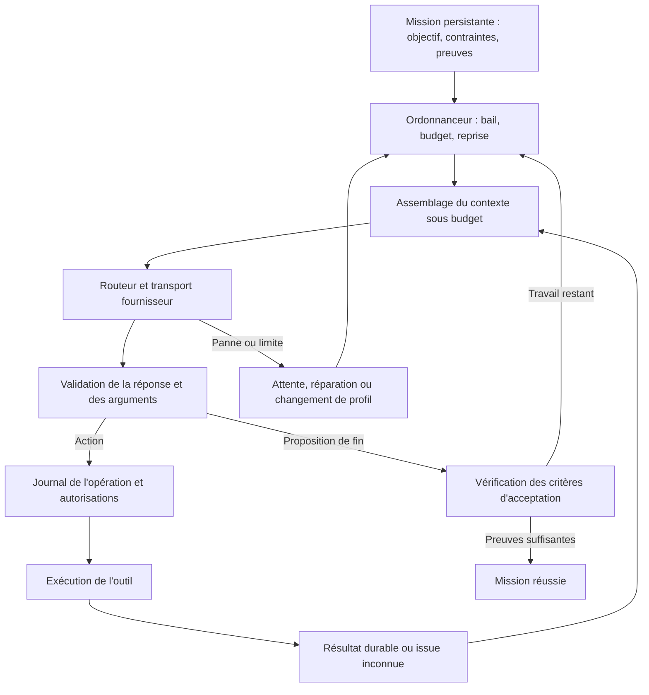

# Audit du harness agentique de LaRuche - 6 septembre 2026

LaRuche dispose d'une base exploitable : moteur ReAct séparé des adaptateurs, décisions testables, outils abstraits, contrôle des répétitions, mémoire et checkpoints. Mon avis est de conserver cette base et de renforcer ses contrats. Les principales failles se trouvent entre les composants : une propriété testée dans le moteur n'est pas forcément préservée par son adaptateur ou par le chemin de reprise.

Le moteur actuel ne garantit pas encore une mission longue autonome et récupérable. Il confond notamment fin de tour et réussite de mission. Une reprise peut rejouer un effet déjà produit ; une erreur de streaming peut devenir une réponse normale ; la compaction peut oublier la demande courante.

## Périmètre et preuves

Audit ciblé de `laruche-butinage`, du pont `laruche-essaim`, des transports, du parsing, des permissions d'exécution et des chemins de missions/reprise du node. Ce document n'est pas un audit exhaustif de sécurité ni un benchmark comparatif d'OpenClaw et Hermes. Aucun modèle distant ou local n'a été appelé pour mesurer sa qualité réelle.

Vérification exécutée dans le workspace :

```powershell
cargo test -p laruche-butinage -p laruche-compaction --locked
```

Résultat : **134 tests butinage + 8 tests compaction réussis**.

Un petit projet indépendant dans [repros](</C:/DEV/coding/Github/laruche-v2/audits/2026-09-06/repros/Cargo.toml>) utilise le véritable moteur via une dépendance locale et des fournisseurs/outils simulés. Il ne fait aucune action externe. Ses cinq tests sont des **témoins des défauts actuels** : ils passent lorsque le défaut est reproduit. Lors d'une correction, il faudra inverser leurs attentes pour en faire des tests de non-régression.

Depuis la racine du dépôt :

```powershell
cargo test --manifest-path audits/2026-09-06/repros/Cargo.toml --locked --lib -- --nocapture
```

Ce projet a son propre lockfile. Les cinq reproductions initiales ont toutes réussi. Le code de production n'a pas été modifié pour cet audit.

| Reproduction | Comportement constaté |
|---|---|
| `witness_open_plan_becomes_success_and_skipped` | Une simple annonce d'intention termine la mission ; ses étapes ouvertes deviennent `NonApplicable`. |
| `witness_exhausted_empty_replies_are_success` | Des réponses vides épuisent les relances puis aboutissent à `Accomplie`. |
| `witness_compaction_bypasses_model_timeout_and_cancel` | L'appel de compaction reste en attente malgré le timeout configuré et le signal d'annulation du moteur. |
| `witness_compaction_keeps_old_question_and_loses_current_mission` | La compaction extractive conserve une ancienne question et supprime la demande courante du transcript. |
| `witness_abort_then_resume_repeats_completed_side_effect` | Interrompre après un effet et avant le checkpoint, puis reprendre, produit l'effet une deuxième fois. |

## 1. P1 - Ne plus confondre fin de tour et mission accomplie

**Constat démontré.** [boussole.rs](</C:/DEV/coding/Github/laruche-v2/laruche/laruche-butinage/src/cap/boussole.rs:165>) ignore le plan inachevé pour terminer un tour textuel. Après épuisement des relances, même une réponse vide ou malformée peut rejoindre `Accomplie`. [cycle.rs](</C:/DEV/coding/Github/laruche-v2/laruche/laruche-butinage/src/cycle.rs:381>) appelle ensuite `itineraire.finaliser()`, qui transforme les étapes ouvertes en `NonApplicable`.

Une fin de tour textuelle est normale pour une conversation. Elle ne constitue pas une preuve que l'objectif d'une mission autonome est atteint. Le commentaire « plan = source de vérité pour la terminaison » ne décrit donc plus le comportement réel.

**Correction :** distinguer `TurnFinished` et `MissionSucceeded`. Ajouter au minimum `NeedsContinuation`, `WaitingForUser`, `WaitingForProvider`, `PausedByBudget`, `Failed`, `Cancelled`. Préserver les étapes ouvertes à l'arrêt. Une étape explicitement abandonnée doit porter une raison ; elle ne doit pas être abandonnée par un nettoyage d'affichage.

Pour une mission longue, définir des critères de succès : livrable présent, tests exécutés, résultats vérifiés, éléments obligatoires couverts. Le modèle propose de terminer ; le harness vérifie ce qui est vérifiable. Une auto-évaluation de confiance n'est pas une preuve indépendante.

Ne pas simplement relancer à l'infini tant que le plan est ouvert : prévoir un nombre borné de tentatives de récupération, puis conserver un état bloqué ou partiel fidèle.

## 2. P1 - Le checkpoint de tour ne protège pas les effets des outils

**Constat démontré.** Les outils s'exécutent dans [recolte.rs](</C:/DEV/coding/Github/laruche-v2/laruche/laruche-butinage/src/recolte.rs:178>), puis le checkpoint arrive en fin de passe dans [cycle.rs](</C:/DEV/coding/Github/laruche-v2/laruche/laruche-butinage/src/cycle.rs:450>). Un arrêt entre ces deux moments perd la connaissance de l'effet déjà appliqué. La déduplication intra-passe ne couvre pas une nouvelle exécution après reprise.

Exemple : un outil applique une modification, le suivant bloque, le processus est interrompu. Le carnet sur disque précède la modification. À la reprise, le modèle peut redemander cette modification. Le test reproduit ce scénario avec un simple compteur, sans mutation externe.

**Correction :** journaliser chaque opération avant son exécution et enregistrer son résultat ensuite. Conserver un identifiant d'opération durable, distinct d'un identifiant de tool call émis par le modèle. États utiles : `Planned`, `Started`, `Succeeded`, `Failed`, `OutcomeUnknown`.

Le journal seul ne garantit pas « exactement une fois » pour une API distante. Après une panne, il faut une clé d'idempotence reconnue par la cible, une vérification de l'état distant, ou une réconciliation explicite. Une issue inconnue ne doit jamais être assimilée à « rien ne s'est passé, réessaie ».

Les échecs de checkpoint sont actuellement seulement journalisés. Pour une mission promettant une reprise durable, une panne de stockage doit devenir visible et empêcher l'accumulation de nouvelles mutations non enregistrées.

## 3. P1 - Les erreurs en cours de streaming n'atteignent pas correctement les retries

**Constat de code.** Les transports retournent `Stream<Item = OllamaChunk>`, sans variante d'erreur dans le flux. Les branches d'erreur réseau de [providers.rs](</C:/DEV/coding/Github/laruche-v2/laruche/laruche-essaim/src/providers.rs:1419>) - également Anthropic vers 1791 et Codex vers 2001 - écrivent un log puis quittent la tâche de lecture. Le pont finit alors son accumulation et peut retourner `Ok(ReponseModele)` ; un `finish_reason` absent peut devenir `FinTour` dans [classer_stop](</C:/DEV/coding/Github/laruche-v2/laruche/laruche-essaim/src/butinage_pont.rs:526>).

Il existe des protections pour certains EOF propres sans événement terminal. Elles ne couvrent pas toutes les erreurs de lecture. Une réponse partielle peut donc être traitée comme une réponse achevée.

Le chemin [Ollama](</C:/DEV/coding/Github/laruche-v2/laruche/laruche-essaim/src/streaming.rs:99>) retire les outils puis essaie `/api/generate` sur toute réponse HTTP non réussie, et ne vérifie pas le statut final avant de lire son corps comme un flux. Cela mélange erreur de modèle, panne serveur, authentification et incompatibilité d'outils.

**Correction :** transporter explicitement `Result<ProviderEvent, ProviderError>`, avec événements de texte, arguments, usage et terminaison. Exiger une terminaison reconnue avant de valider la génération. Ne pas exécuter un appel dont les arguments ou la génération sont incomplets. Classifier séparément panne transport, limite de sortie, filtre, contexte trop long et incompatibilité de protocole.

Les tâches de lecture démarrées avec `tokio::spawn` doivent aussi avoir une durée de vie rattachée à l'appel : abandonner le consommateur ne suffit pas à arrêter immédiatement une tâche bloquée sur le réseau.

## 4. P1 - La compaction contourne les protections de l'appel principal

**Constat démontré.** [escale.rs](</C:/DEV/coding/Github/laruche-v2/laruche/laruche-butinage/src/escale.rs:90>) appelle directement `fournisseur.repondre(...).await` ; la consolidation fait de même vers 223. Ces appels ne passent pas par le wrapper de retry, timeout et annulation de `cycle.rs`.

Leur usage ne rejoint pas non plus les compteurs du carnet. Leurs réponses ne sont pas soumises à un contrat fort de résumé complet et exploitable. Un texte partiel non vide suffit à remplacer l'historique.

**Correction :** un exécuteur commun pour *tous* les appels LLM, avec un rôle d'appel : travail, compaction, validation, approbation, extraction. Il applique les délais, l'annulation, les retries, l'attribution des coûts et la validation de terminaison. Chaque rôle peut avoir son propre modèle et son propre budget de sortie.

Pour un modèle local lent, séparer délai de démarrage, délai sans activité du flux et délai total. Une génération qui avance lentement n'est pas une connexion morte.

La sémantique de `tokio::time::timeout` porte sur la future annulée ; elle ne constitue pas une transaction annulant les effets externes déjà produits. Voir la [documentation Tokio](https://docs.rs/tokio/latest/tokio/time/fn.timeout.html). Le message d'un timeout d'outil devrait donc pouvoir dire « résultat inconnu », plutôt qu'affirmer systématiquement que l'opération a été annulée.

## 5. P1 - L'ancre de contexte peut être la mauvaise mission

**Constat démontré pour le repli extractif.** Le pont réinjecte l'historique de session avant la demande courante dans [butinage_pont.rs](</C:/DEV/coding/Github/laruche-v2/laruche/laruche-essaim/src/butinage_pont.rs:2773>). La compaction choisit le *premier* message utilisateur comme ancre ; la troncature protège le début de l'historique. Ce premier message peut concerner une ancienne demande.

La mission courante existe dans `carnet.mission`, mais [assembler](</C:/DEV/coding/Github/laruche-v2/laruche/laruche-butinage/src/cycle.rs:604>) ne la réinjecte pas systématiquement comme bloc d'objectif. Le repli extractif ne conserve que les noms d'outils et deux observations abrégées. Une compaction peut ainsi garder une ancienne question et supprimer la mission en cours du contexte envoyé au modèle.

**Correction :** réserver un bloc de mission indépendant du transcript : objectif courant, contraintes utilisateur, corrections apportées en cours de route, critères d'acceptation, étapes ouvertes et prochaine action. Identifier les messages d'ancrage par identifiant de mission et type, pas par position ou par rôle.

La compaction devrait proposer un nouvel état puis le valider avant de remplacer l'ancien : contraintes conservées, liens vers preuves accessibles, absence d'outils orphelins, taille sous budget. Garder l'historique brut comme archive consultable. Un résumé est une vue de travail, pas la seule copie des faits.

Le ledger de découvertes constitue un bon début, mais ses 40 entrées FIFO de 400 caractères peuvent perdre des faits anciens et tronquer une URL. Stocker fait, source, preuve et importance dans des champs distincts ; sélectionner un sous-ensemble pour le prompt sans supprimer l'archive.

## 6. P1 - Le failover annoncé n'est pas branché sur la boucle principale

**Constat de code.** `fallback_models` est configurable, mais le fournisseur du pont reste un couple provider/modèle fixe. [appeler_modele](</C:/DEV/coding/Github/laruche-v2/laruche/laruche-butinage/src/cycle.rs:734>) passe `false` pour rotation et déroutement, avec un commentaire supposant leur prise en charge par l'adaptateur.

Le pont choisit une clé et incrémente son utilisation. Il ne marque pas cette clé invalide ou limitée après erreur. Les appels à `marquer_rate_limited` et `marquer_invalide` trouvés dans le dépôt sont dans les tests du pool. Le choix au moindre nombre d'utilisations peut alterner les clés, mais ce n'est pas une politique de récupération tenant compte de leur santé.

Le transport compatible OpenAI renvoie aussi `retry_after: None` dans son erreur HTTP générale. La politique sait utiliser un délai que ce chemin ne lui transmet pas.

**Correction :** créer un routeur de fournisseurs réellement propriétaire des tentatives : profil complet du candidat, santé, cooldown, clé sélectionnée, raison d'échec et prochain candidat. Un fallback doit emporter URL, authentification, capacités et paramètres propres au modèle, et non un simple nom.

Réessayer une erreur transitoire avec délai borné et jitter ; respecter les indications de reprise ; réparer un dépassement de contexte ; traiter les paramètres incompatibles une fois ; ne pas répéter une erreur déterministe identique. Lors d'un changement de fournisseur, reconstruire les messages selon son protocole et son identité de modèle.

## 7. P1 - Le parsing tolérant peut transformer du texte explicatif en action

**Constat de code.** [butinage_pont.rs](</C:/DEV/coding/Github/laruche-v2/laruche/laruche-essaim/src/butinage_pont.rs:274>) essaie les tool calls textuels dès qu'aucun appel natif n'est présent, sans conditionner ce repli au profil natif. [parsing.rs](</C:/DEV/coding/Github/laruche-v2/laruche/laruche-essaim/src/parsing.rs:201>) recherche même des objets JSON à l'intérieur de la prose.

Un modèle expliquant un exemple `{"name":"file_write","arguments":...}` peut donc produire une demande d'exécution. Les permissions limitent les conséquences, mais elles ne corrigent pas la confusion entre exemple et intention d'agir.

**Correction :** choisir explicitement le protocole du run : outils natifs, enveloppe JSON contrainte, ou protocole textuel strict. Ne pas inférer une action depuis du texte libre dans un run natif. Pour le mode textuel, exiger une enveloppe dédiée et une réponse entière conforme ; préserver les exemples comme texte.

Le parseur brut possède aussi un comptage d'accolades non conscient des chaînes, et une déduplication par nom d'outil qui peut supprimer deux appels légitimes aux arguments différents. Réutiliser un parseur JSON réel et dédupliquer selon une identité d'opération adaptée.

## 8. P2 - La validation JSON Schema est partielle

**Constat de code.** [valider_et_normaliser_args](</C:/DEV/coding/Github/laruche-v2/laruche/laruche-essaim/src/abeille.rs:481>) normalise certaines valeurs puis vérifie les propriétés requises et les types de premier niveau. Ce n'est pas une validation récursive : `enum`, bornes, contraintes des éléments de tableaux, objets imbriqués ou unions ne sont pas garantis par cette fonction. Des outils peuvent ajouter leurs propres contrôles, mais le contrat commun ne les assure pas.

Les commandes interceptées par `analyser`, comme `mission_accomplie`, ont encore un chemin distinct : valeurs par défaut avant la validation des appels ordinaires.

**Correction :** normalisation syntaxique limitée puis validation récursive avec un dialecte de schéma défini et testé. Renvoyer un diagnostic court, précis et exploitable : chemin de propriété, valeur reçue, type attendu. Ne pas inventer un argument métier manquant. Faire valider les commandes de contrôle par un contrat équivalent.

## 9. P2 - Le budget ne couvre pas l'ensemble du travail

**Constat de code.** La jauge inclut les schémas, ce qui est bien. Mais la troncature dure ne les reçoit pas, et le bloc final assemblé - découvertes, contexte volatil, nouvelles capacités - n'est pas entièrement compté avant envoi. La réservation de sortie n'est pas exprimée dans cette décision.

Le pont principal laisse `budget_tokens` à sa valeur par défaut, zéro. Les appels auxiliaires ne l'alimentent pas. Les enfants héritent de paramètres, mais leurs dépenses ne sont pas débitées d'une enveloppe partagée avec le parent.

Pour une fenêtre de 8 000 tokens, le plancher d'observation de 24 000 caractères représente déjà environ 6 000 tokens selon l'estimation utilisée, avant les instructions, schémas, autres messages et sortie. Le `.max(8_000)` du pont peut aussi surestimer une fenêtre configurée plus petite. Le projet possède déjà un probe `n_ctx` pour llama.cpp : il faut conserver ce mécanisme et prolonger la cohérence jusqu'à l'assemblage final.

**Correction :** budgéter la requête finale complète, réserver la sortie et une marge, puis plafonner chaque observation selon la place réellement disponible. Utiliser le tokenizer ou l'estimation fournie par le backend lorsqu'elle est disponible. Partager un budget de mission incluant enfants, retries, compaction et supervision ; débiter chaque tentative et conserver les coûts inconnus comme estimés.

## 10. P1/P2 - La reprise applicative ne restitue pas encore tout l'état

**Constats de code complémentaires :**

- [reprendre_carnet](</C:/DEV/coding/Github/laruche-v2/laruche/laruche-essaim/src/butinage_pont.rs:3075>) désérialise directement le JSON au lieu d'utiliser `Carnet::charger`. Il saute ainsi la réhydratation des images externalisées dans les fichiers annexes.
- Le chemin de reprise reconstruit un `working_dir: None` et un contexte de permissions sans canal d'approbation interactif. Il ne restaure pas le contexte de travail exact du run d'origine.
- Les checkpoints atteignant le plafond gardent leur compteur ; reprendre avec le même plafond arrête immédiatement le moteur. Une pause à reprendre et un échec terminal doivent avoir des sémantiques distinctes.
- [api_carnet_resume](</C:/DEV/coding/Github/laruche-v2/laruche/laruche-node/src/missions_api.rs:511>) démarre une tâche sans acquisition visible d'un verrou durable du carnet. Deux demandes peuvent engager deux reprises du même état.
- La reprise retourne `Result<String>` et l'API annonce une fin sur `Ok`, alors qu'un `Bilan` portant une erreur ou un plafond peut lui aussi aboutir à cette chaîne.
- Au démarrage, les carnets de plus de trois jours sont supprimés. Cela ne correspond pas à une conservation durable de missions suspendues.

**Correction :** un état de mission versionné comprenant contexte de travail, profil, contraintes, budget et motif de suspension ; un bail exclusif par mission ; une transition atomique de reprise ; un résultat typé transmis jusqu'à l'UI. Distinguer rétention des missions actives et nettoyage des historiques terminés.

Le node possède déjà des missions à cadence et une mémoire par mission. Il faut les raccorder à cet état durable. Relancer une session avec un extrait de mémoire ne garantit pas la reprise exacte d'une opération interrompue.

## Architecture cible : prolonger le moteur existant



Le modèle choisit des actions et propose des plans. Le harness possède l'état, les limites, le journal, les autorisations et la décision de reprise. Le scheduler décide quand un nouveau segment d'exécution peut commencer. La mémoire aide à rappeler des informations ; elle ne remplace pas le journal transactionnel des opérations.

Garder `butiner` comme boucle d'exécution bornée. Ajouter autour un gestionnaire durable de mission plutôt que transformer cette boucle en un run infini. Une mission de plusieurs heures peut être composée de segments courts, chacun laissant un état exploitable et une raison de sortie précise.

## Petits modèles locaux et gros modèles distants

Un petit modèle peut être fiabilisé sur le format, les limites et des sous-tâches précises. Le harness ne peut pas garantir qu'il aura la même capacité de raisonnement qu'un modèle plus fort. L'escalade doit être une capacité prévue du système, avec une décision compréhensible et une limite de coût.

Remplacer progressivement les devinettes basées sur le nom du modèle par un profil de capacités mesurées, identifié par backend, modèle et template : fenêtre effective, formats d'outils, JSON contraint, vision, parallélisme, usage, modalités de raisonnement et débit observé. Conserver les réglages manuels comme overrides explicites.

Pour un modèle faible, envoyer peu d'outils utiles et un objectif immédiat clair ; favoriser une action à la fois ; fournir des erreurs de validation brèves ; externaliser les grosses observations. Utiliser un petit test de conformité du profil avant de lui confier une longue mission.

Les sorties structurées existent côté Ollama via `format` et côté llama.cpp via ses mécanismes de schéma/grammaire. Elles peuvent fiabiliser une enveloppe d'action lorsque les tool calls natifs ne conviennent pas. Elles ne garantissent pas la pertinence des arguments ni la réussite métier. Voir [Ollama](https://docs.ollama.com/capabilities/structured-outputs) et [llama.cpp server](https://github.com/ggml-org/llama.cpp/blob/master/tools/server/README.md).

Sur un serveur local partagé, limiter aussi la concurrence d'inférence à l'échelle du backend, et pas seulement le nombre d'outils parallèles d'un run. Quatre agents peuvent partager une seule ressource GPU : leur indépendance logique ne garantit pas un gain de débit.

## Ordre de correction conseillé

1. **Vérité des états :** aucune réponse vide, interruption, erreur ou tâche inachevée ne devient un succès. Propager le résultat typé jusqu'à l'interface.
2. **Porte d'entrée LLM commune :** erreurs de streaming, terminaison, annulation, deadlines, coûts ; y brancher compaction et supervision.
3. **Reprise durable :** journal des opérations, issue inconnue, bail exclusif, réhydratation, restauration du contexte et politique de reprise.
4. **Contexte :** ancre de mission indépendante, état de travail structuré, budget de la requête complète, archive des observations.
5. **Compatibilité des modèles :** protocoles explicites, validation récursive, profils de capacités, fallback réellement câblé et budget partagé.
6. **Évaluations :** faire tourner la même matrice sur plusieurs profils ; mesurer le résultat final et les violations de contrat, en plus du coût et du nombre d'actions.

Le jeu d'évaluations actuel est une bonne amorce, mais ses huit missions portent surtout sur la recherche et des contrôles simples. `min_web`, le nombre de délégations et quelques mots obligatoires mesurent une activité. Dans la récolte, le compteur web augmente même sur certains échecs ; une délégation reçoit un poids conventionnel. Cela ne prouve ni découverte utile ni accomplissement.

Ajouter des scénarios déterministes de panne : coupure SSE à différentes positions, 429 avec reprise datée, crash avant/après effet, double reprise, petit contexte saturé, cinq compactions successives, changement de modèle, outil lent, sortie invalide, annulation pendant compaction et budget atteint par les enfants. Pour les missions réelles, vérifier les artefacts, leur contenu, les tests et la traçabilité des affirmations.

Mon choix de priorité pour un développeur seul : concentrer les prochains changements sur ces invariants et leur validation. La largeur fonctionnelle de LaRuche est déjà importante ; fiabiliser le chemin objectif → action → preuve → reprise donnera une base solide aux fonctionnalités existantes.
